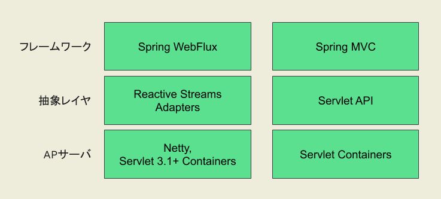
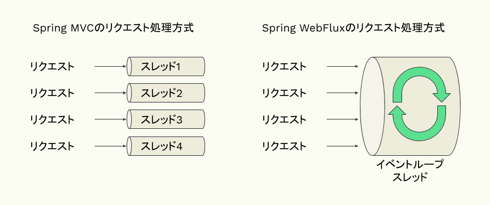
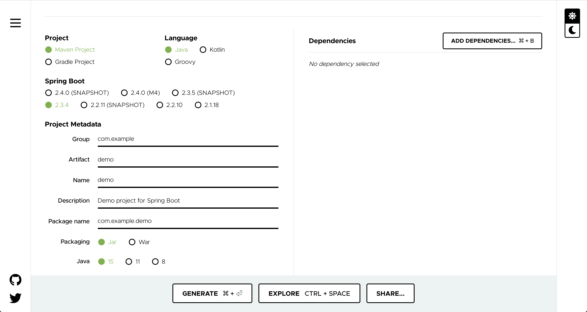
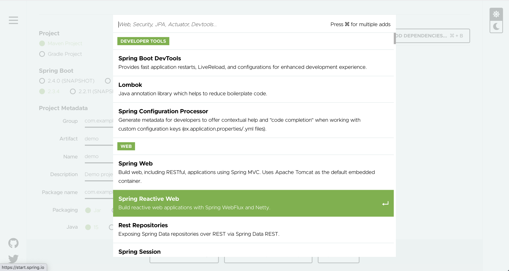

:toc: left
:toctitle: 目次
:sectnums:
:sectanchors:
:sectinks:
:chapter-label:

= 01 マイクロサービス時代のフレームワーク Spring WebFluxとは

昨今、マイクロサービスアーキテクチャによるアプケーション開発がとても注目を集めています。
マイクロサービスアーキテクチャでは、文字通り小さなサービスを多数組み合わせて1つのアプリケーションを構成することから、
個々のサービスには高いリソース効率性が求められています。
また、従来のモノリシックなアプリケーションと比べて、サービス間通信が多く発生することから、
高い処理能力（高スループット）も求められています。

Javaで高いリソース効率性と高い処理能力を持つアプリケーションを開発するためのフレームワークの一つとして、
Spring FrameworkファミリーのSpring WebFluxがあります。

本連載では、Spring WebFluxによるアプリケーションの作り方を始め、
Spring WebFluxを理解する上で重要となるリアクティブプログラミングや、
Spring WebFluxベースのHTTPクライアントであるWebClient、
Spring WebFluxと親和性の高いデータベースアクセスの仕組みであるR2DBCを解説していきます。

== Spring WebFluxの概要・特徴

Spring FrameworkにはWebアプリケーションを作るためのフレームワークとしてSpring MVCとSpring WebFluxの2つがあります。
Spring MVCとSpring WebFluxの技術スタックには下図のような違いがあります。

Spring MVCはサーブレットをベースとしており、Tomcatなどのサーブレットコンテナの上で動作します。
それに対して、Spring WebFluxはNettyなどのノンブロッキングI/Oベースのアプリケーションサーバの上で動作します。
ノンブロッキングI/Oとは、ネットワークアクセスやDBアクセスなどのI/O処理の呼び出しに対して、
読み書きができる場合は処理を行い、読み書きができない場合には即座に処理を戻すという仕組みです。
読み書きができない場合に別の処理を行わせることができるため、CPUを効率的に利用することが可能になります。
Spring WebFluxでは、ノンブロッキングI/Oの仕組みを活かし、1つのスレッドで複数のリクエストを処理します。
そのため、同時処理数分だけスレッドを必要とするSpring MVCなどと比べて、必要となるスレッド数が少なくなり、
必要となるメモリサイズも小さくなります。

また、ノンブロッキングな処理を実装しやすくするための仕組みとして、
Spring WebFluxではReactorによるリアクティブプログラミングを採用しています。
リアクティブプログラミングとは、データに着目したイベント駆動型のプログラミングの一種で、
通知されるデータを受け取って処理を行うハンドラを実装することによって連続的なデータを処理する手法です。
Reactorはリアクティブプログラミングを実現するためのライブラリの一つであり、
ノンブロッキングで非同期なリアクティブプログラミングの仕組みを提供しています。
Spring WebFluxではReactorのAPIを使うことによって低レベルなノンブロッキングI/Oの仕組みを隠蔽し、
より抽象度の高い形でノンブロッキングな処理を実装できるようにようにしています。

== Spring WebFluxのユースケース・事例

Spring WebFluxは高いリソース効率性と高スループットが特徴となっています。
そのため、冒頭でも述べたようにマイクロサービスアーキテクチャのシステムに適しているといえます。
国内では、クックパッドのシステムにおいてAPIオーケストレーション層の実装として採用されているlink:https://techlife.cookpad.com/entry/2018-odaiba-strategy[事例]が紹介されています。
また、マイクロサービスアーキテクチャではなくても、同時接続数が多いシステムであれば、Spring WebFluxを採用することでインフラコストを抑えることができます。
例えば、LINEの内部では一部Spring WebFluxを使用しているとのlink:https://speakerdeck.com/line_developers/examples-of-using-spring-and-webflux-in-the-chat-system-for-line-official-accounts[事例]が発表されています。
そのほか、同時接続数が多いものとしてはIoTの領域において多数のセンサデータを処理するシステムなどが挙げられます。

== Spring WebFluxによるHello Worldアプリケーションの作成

それでは実際にSpring WebFluxを使ったHello Worldアプリケーションを作成してみましょう。
ここではSpring Initializrを使ってプロジェクトのひな形を作成します。

まず、 https://start.spring.io/[Spring Initializr] にアクセスします。
画面左側の各種パラメータを下記のように指定します。

|===
| Project | Maven Project
| Language | Java
| Spring Boot | 2.3.4
| Group | com.example
| Artifact | demo
| Name | demo
| Description | Demo project for Spring Boot
| Package Name | com.example.demo
| Packaging | Jar
| Java | 15
|===

画面右側の「Add Dependencies」を選択し、表示されるダイアログの中から「Spring Reactive Web」を選択します。
そして、画面下部の「Generate」を選択し、プロジェクトのひな形をzipファイルとしてダウンロードします。

次に生成したプロジェクトひな形の中身を確認してみましょう。
zipファイルを解凍すると以下のような構成になっています。

[source]
----
demo
├── HELP.md
├── mvnw
├── mvnw.cmd
├── pom.xml
└── src
    ├── main
    │   ├── java
    │   │   └── com
    │   │       └── example
    │   │           └── demo
    │   │               └── DemoApplication.java
    │   └── resources
    │       └── application.properties
    └── test
        └── java
            └── com
                └── example
                    └── demo
                        └── DemoApplicationTests.java
----

`pom.xml` の内容を確認してみます。
すると、以下のように依存関係として `spring-boot-starter-webflux` が含まれています。
これがSpring BootでSpring WebFluxのアプリケーションを作る際のスターターになります。

[source, xml]
----
<dependencies>
    <dependency>
        <groupId>org.springframework.boot</groupId>
        <artifactId>spring-boot-starter-webflux</artifactId>
    </dependency>
</dependencies>
----

そのほか、テストスコープの依存関係として `reactor-test` も含まれています。

続いて、Hello Worldを返すエンドポイントを実装していきます。
Spring WebFluxには、アノテーションとクラスを使った実装方法と、
`HandlerFunction` や `RouterFunction` などの関数を利用した関数型プログラミングによる実装方法がありますが、
本連載では、アノテーションとクラスを使った実装方法で解説します。

[source, java]
----
package com.example.demo;

import org.springframework.web.bind.annotation.GetMapping;
import org.springframework.web.bind.annotation.RestController;
import reactor.core.publisher.Mono;

@RestController                             // <1>
public class HelloWorldController {

    @GetMapping("/greeting")                // <2>
    public Mono<String> greeting() {        // <3>
        return Mono.just("Hello World!");   // <4>
    }
}
----
<1> Spring Web MVCと同様、@RestControllerアノテーションを付与することでREST APIのControllerクラスとして指定することができます。
<2> Spring Web MVCと同様、@GetMappingアノテーションを付与することでGETリクエストに対応するエンドポイントを指定することができます。
<3> メソッドの返り値の型として、Reactorの型であるMonoクラスを指定しています。
<4> ”Hello World!"の文字列を出力するMonoを生成して返却します。

それではアプリケーションを起動してみましょう。
ターミナルを開き、プロジェクトのルートディレクトリ上でmvnwコマンドを実行します。

[source]
----
$ ./mvnw spring-boot:run
[INFO] Scanning for projects...
[INFO]
[INFO] --------------------------< com.example:demo >--------------------------
[INFO] Building demo 0.0.1-SNAPSHOT
[INFO] --------------------------------[ jar ]---------------------------------
[INFO]
[INFO] >>> spring-boot-maven-plugin:2.3.4.RELEASE:run (default-cli) > test-compile @ demo >>>
[INFO]
[INFO] --- maven-resources-plugin:3.1.0:resources (default-resources) @ demo ---
[INFO] Using 'UTF-8' encoding to copy filtered resources.
[INFO] Copying 1 resource
[INFO] Copying 0 resource
[INFO]
[INFO] --- maven-compiler-plugin:3.8.1:compile (default-compile) @ demo ---
[INFO] Changes detected - recompiling the module!
[INFO] Compiling 1 source file to /Users/media/Downloads/demo/target/classes
[INFO]
[INFO] --- maven-resources-plugin:3.1.0:testResources (default-testResources) @ demo ---
[INFO] Using 'UTF-8' encoding to copy filtered resources.
[INFO] skip non existing resourceDirectory /Users/media/Downloads/demo/src/test/resources
[INFO]
[INFO] --- maven-compiler-plugin:3.8.1:testCompile (default-testCompile) @ demo ---
[INFO] Changes detected - recompiling the module!
[INFO] Compiling 1 source file to /Users/media/Downloads/demo/target/test-classes
[INFO]
[INFO] <<< spring-boot-maven-plugin:2.3.4.RELEASE:run (default-cli) < test-compile @ demo <<<
[INFO]
[INFO]
[INFO] --- spring-boot-maven-plugin:2.3.4.RELEASE:run (default-cli) @ demo ---
[INFO] Attaching agents: []

  .   ____          _            __ _ _
 /\\ / ___'_ __ _ _(_)_ __  __ _ \ \ \ \
( ( )\___ | '_ | '_| | '_ \/ _` | \ \ \ \
 \\/  ___)| |_)| | | | | || (_| |  ) ) ) )
  '  |____| .__|_| |_|_| |_\__, | / / / /
 =========|_|==============|___/=/_/_/_/
 :: Spring Boot ::        (v2.3.4.RELEASE)

2020-10-30 00:58:50.233  INFO 6663 --- [           main] com.example.demo.DemoApplication         : Starting DemoApplication on GeorgeMedianoMacBook-Pro.local with PID 6663 (/Users/media/Downloads/demo/target/classes started by media in /Users/media/Downloads/demo)
2020-10-30 00:58:50.236  INFO 6663 --- [           main] com.example.demo.DemoApplication         : No active profile set, falling back to default profiles: default
2020-10-30 00:58:51.609  INFO 6663 --- [           main] o.s.b.web.embedded.netty.NettyWebServer  : Netty started on port(s): 8080
2020-10-30 00:58:51.621  INFO 6663 --- [           main] com.example.demo.DemoApplication         : Started DemoApplication in 2.058 seconds (JVM running for 2.432)
----

標準出力の内容を見てみると、Nettyサーバが起動していることが分かります。
続いて、curlで先ほど実装したエンドポイントにアクセスし、Hello World!の文字列が返ってくることを確認してみましょう。

[source]
----
$ curl http://localhost:8080/greeting
Hello World!
----

今回はSpring WebFluxの概要および簡単なアプリケーションの作り方を解説しました。
次回はSpring WebFluxを使う上で欠かせない要素であるリアクティブプログラミングについて詳しく解説します。
