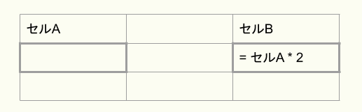
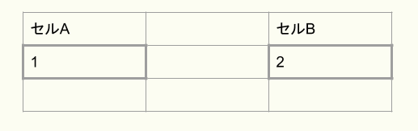
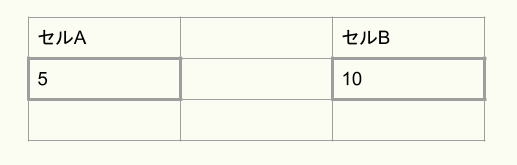
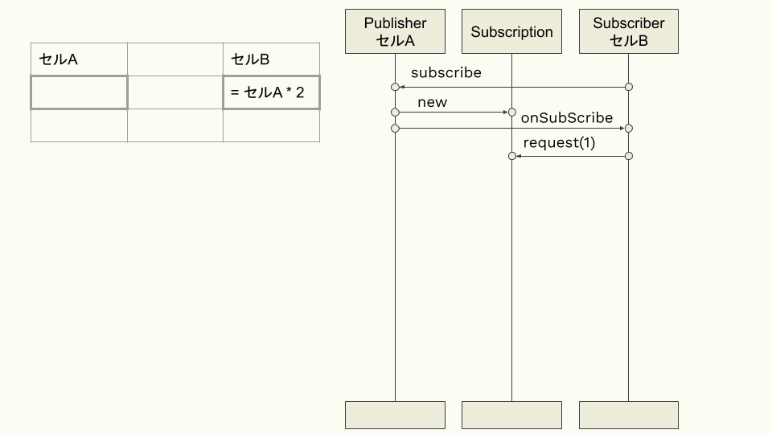
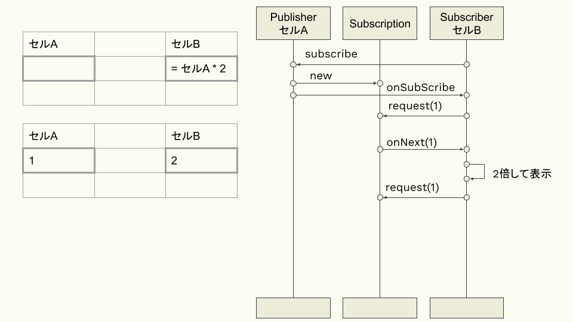
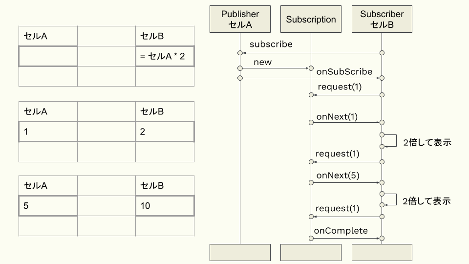

:toc: left
:toctitle: 目次
:sectnums:
:sectanchors:
:sectinks:
:chapter-label:

= 02 Spring WebFluxの要 リアクティブプログラミング入門

今回は、Spring WebFluxを使う上で欠かせない要素である、リアクティブプログラミングおよびReactorについて解説します。

== リアクティブプログラミングの基本

リアクティブプログラミングとは、データに着目したイベント駆動型のプログラミングの一種で、
通知されるデータを受け取って処理を行うハンドラを実装することによって連続的なデータを処理するプログラミング手法です。

リアクティブプログラミングを用いている身近な例としてよく挙げられるものが表計算ソフトです。
ここでは、表計算ソフトの例を使い、リアクティブプログラミングの基本的な考え方について解説します。

下図のように、表計算ソフトのシート上に、セルA、セルBがあるとします。
この時、セルCには「セルA * 2」という計算式が定義されています。
この計算式が「通知されるデータを受け取って処理を行うハンドラ」にあたります。

では、次にセルAに「1」という数値を入力した場合を考えてみましょう。
セルAに数値が入力されると、セルAの値が変わったというイベントが発生します。
セルBはセルAの変更された値を受け取り、定義された計算式に基づく計算を実行し、結果として「2」を表示します。

続いて、セルAの値を「5」に変更してみるとどうなるでしょうか。
この場合、セルAの値が「5」に変わったというイベントが発生し、セルBは計算を再度実行します。
そして、新しい結果として「10」を表示します。

このように、データの生成・変更といったイベントに応じて処理を行うことから
リアクティブ（＝反応的）プログラミングと呼ばれています。

== リアクティブプログラミングとReactive Streams

リアクティブプログラミングを実現するライブラリには様々なものがあります。
主要なライブラリとしては以下のようなものがあります。

|===
| ライブラリ | 概要

| Reactive Extensions（ReactiveX）
| Microsoftが公開した.NET Frameworkのライブラリ。 +
  現在はReactiveXとしてOSS化されており、後述のRxJavaのほか、Javascript向けやSwift向けの実装も提供しています。

| RxJava
| Reactive ExtensionsをJavaに移植したもの。 +
  現在はReactiveXの一部となっています。

| Akka
| Lightbend社が開発している平行・分散アプリケーションのためのツールキット。

| Eclipse Vert.x
| イベントドリブンなアプリケーションフレームワーク。 +
  JVM上で動作しますが、Java以外にもJavaScriptやRubyなどで実装できます。

| Reactor
| VMWare（旧Pivotal）によって開発されているリアクティブプログラミングのライブラリ。 +
  Spring WebFluxの内部で使用されています。
|===

当初はそれぞれ個別に実装が進められていましたが、
やがて共通のAPIを策定することになりました。
それがReactive Streamsです。

Reactive Streamsは、API定義、仕様、TCK（Technology Compatibility Kit、実装が仕様を満たしていることを確認するためのテストコード群）からなり、
Java向けのAPIのほか、Javascriptや.NET、Swift向けのものも提供されています。
Java向けにはインタフェースの形でAPIが提供されています。

Reactive Streamsの大きな特徴はバックプレッシャーという仕組みを定義していることです。
バックプレッシャーとは、データを受け取る側がデータの送信元に対して送信量を制御する仕組みのことです。
データの送信元よりもデータを受け取る側の処理速度が遅いようなケースにおいて、
受け取る側は自身が処理可能なデータ量を送信元に通知し、送信元は通知内容に基づいてデータを送信することによって、
データを溢れさせずに処理することが可能になります。

それでは、Reactive StreamsのAPI仕様について詳しく見てみましょう。
Reactive StreamsのAPI仕様は、Publisher、Subscriber、Subscription、そしてProcessorという、
4つのAPIコンポーネントからなる非常にシンプルなものとなっています。
Java向けのAPIとしては以下の4つのインタフェースとして提供されています。

[source, java]
----
public interface Publisher<T> {
    public void subscribe(Subscriber<? super T> s);
}

public interface Subscriber<T> {
    public void onSubscribe(Subscription s);
    public void onNext(T t);
    public void onError(Throwable t);
    public void onComplete();
}

public interface Subscription {
    public void request(long n);
    public void cancel();
}

public interface Processor<T, R> extends Subscriber<T>, Publisher<R> {
}
----

これらのAPIコンポーネントの機能は以下の通りです。

|===
| APIコンポーネント | 概要

| Publisher
| データの送信元となるコンポーネント。 +
  subscribeメソッドによって、Publisherがデータを送信する先のSubscriberを設定します。

| Subscriber
| データを受け取る側となるコンポーネント。 +
  SubscriberをPublisherに設定すると、onSubscribeメソッドが呼ばれ、Subscriptionを受け取ります。 +
  onNextメソッドを通じてデータを受け取ります。 +
  全てのデータを受信すると、最後にonCompleteメソッドが呼ばれます。 +
  途中でエラーが発生した場合には、onErrorメソッドが呼ばれます。

| Subscription
| PublisherとSubscriberを仲介する役目のコンポーネント。 +
  requestメソッドによって、Subscriberは受け取り可能なデータ数を指定することができます。（バックプレッシャー） +
  cancelメソッドによって、Subscriberはデータの受け取りを中止することができます。

| Processor
| PublisherとSubscriberの両方の機能を持つコンポーネント。

|===

では、先ほどの表計算ソフトの例を使って、Reactive Streamsにおいてどのような流れで処理が行われるのか見てみましょう。 +
セルAはデータの送信元にあたるため、Reactive StreamsにおけるPublisherと考えることができます。 +
セルBはデータを受け取る側にあたるため、Reactive StreamsにおけるSubscriberと考えることができます。 +

この例では計算式で直接セルAを指定していますが、
Reactive Streams流に読み替えると、受け取った値を2倍して表示するSubscriberの処理（SubscriberのonNextメソッド）を定義し、
SubscriberをPublisherに登録する、となります。 +
すると、内部的にはPublisherはSubscriptionを生成し、
SubscriberであるセルBに対してonSubscribeメソッドを通じてsubscriptionを渡します。 +
セルBはSubscrptionのrequestメソッドを通じてデータを1個送信するよう要求します。 +

セルAに「1」を入力するという操作はPublisherであるセルAから「1」というデータを送信する処理に該当します。 +
この場合、セルAはSubscriptionを通じてセルBのonNextメソッドに「1」というデータを渡します。 +
セルBのonNextメソッドには「受け取った値を2倍して表示する」という処理が定義されているため、 
その処理が実行されることによりセルBに「2」が表示されることになります。 +
また、セルBでは要求した1個のデータを受け取ったため、再度requestメソッドで次のデータを送信するよう要求します。 +

セルAに「5」を入力すると先ほどと同様の処理が行われ、セルBに「10」が表示されます。 +
表計算ソフトではセルに入力する値を変えることで無限にデータを送信することが可能ですが、
仮に入力値が「1」と「5」の2個だけであるとすると、
セルAはSubscriptionを通じてSubscriberのonCompleteメソッドを呼び出し、データ送信が完了したことを通知します。

== Reactor入門

ここからは、Spring WebFluxにも使われているリアクティブプログラミングのライブラリ、Reactorについて解説していきます。
ReactorはReactive Streamsの仕様を実装しつつも、関数型の考え方・インタフェースを取り入れ、
Stream APIのようにラムダ式を引数にしてデータのフィルタリングや変換などの処理を実装できるAPIを提供するライブラリです。

Reactorを理解する上で重要となるクラスがFluxとMonoです。

FluxはReactive StreamsにおけるPublisherインタフェースを実装しており、0個以上のデータを持つデータ列を扱うためのクラスです。 +
以下のように、justメソッドを使うことでFluxを生成することができます。 +
この例では、これまでの例で出てきたような「1」と「5」という2つの整数データを持つFluxを生成しています。 +
生成したFluxのsubscribeメソッドを使ってデータを受け取った時の処理を定義することができます。 +
Reactorでは、ラムダ関数をsubscribeメソッドに渡すことで、Reactive StreamsにおけるSubscriberを内部的に生成することができるようになっています。 +
「受け取った値を2倍して表示する」Subscriberを実装すると以下のようになります。

[source, java]
----
Flux<Integer> input = Flux.just(1, 5);
input.subscribe(d -> System.out.println(d * 2));
----

MonoもFlux同様Publisherインタフェースを実装したクラスですが、0個または1個のデータを扱うためのクラスです。
MonoにもFluxと同様にjustメソッドやsubscribeメソッドが用意されており、以下のように使うことができます。

[source, java]
----
Mono.just("Hello, Mono")
    .subscribe(str -> System.out.println(str));
----

FluxとMonoにはオペレータと呼ばれる様々なメソッドが用意されており、
オペレータをメソッドチェーンで繋げていくことによって処理を実装します。
オペレータは基本的にラムダ関数を引数として受け取り、ラムダ関数で定義した内容に基づいた処理を行うPublisherを生成します。
ここでは、よく使うオペレータをいくつか紹介します。

mapは個々のデータに対して処理を行うためのオペレータです。
以下の例では、受け取った整数に対して2倍した値を返す処理を定義しています。

[source, java]
----
Flux.just(1, 2, 3, 4, 5)
  .map(i -> i * 2)
  .subscribe(d -> System.out.println(d));

Mono.just(10)
  .map(i -> i * 2)
  .subscribe(d -> System.out.println(d));
----

flatMapはmapと同様に個々のデータに対して処理を行いますが、結果としてFluxやMonoなどを返す処理を行うためのオペレータです。
例えば、Fluxの個々の値を元にAPIリクエストなどの非同期処理を実行したい場合などに使用します。
以下の例では、先ほどのmapの例と同様、受け取った整数に対して2倍した値を返す処理を定義していますが、
ラムダ関数の返り値がMonoとなっているため、mapではなくflatMapを使用しています。

[source, java]
----
Flux.just(1, 2, 3, 4, 5)
  .flatMap(i -> Mono.just(i * 2))
  .subscribe(d -> System.out.println(d));

Mono.just(1, 2, 3, 4, 5)
  .flatMap(i -> Mono.just(i * 2))
  .subscribe(d -> System.out.println(d));
----

filterは条件に合致するデータのみを抽出するためのオペレータです。
以下の例では、受け取った整数に対して、2で割り切れるもののみを抽出する処理を定義しています。

[source, java]
----
Flux.just(1, 2, 3, 4, 5)
  .filter(i -> i % 2 == 0)
  .subscribe(d -> System.out.println(d));
----

ここで紹介した以外のオペレータについて知りたい場合には link:https://projectreactor.io/docs/core/release/reference/[公式ドキュメント] を参照してください。
また、公式ドキュメントでは実現したいことから逆引きでオペレータを見つけることもできます。

今回は、Spring WebFluxの要となるリアクティブプログラミングの考え方、リアクティブプログラミングの標準であるReactive Streams、
そしてSpring WebFlux内部で使用されているリアクティブプログラミングのライブラリであるReactorについて解説しました。
次回は、Spring WebFluxに内包された次世代のHTTPクライアント、WebClientについて解説します。
