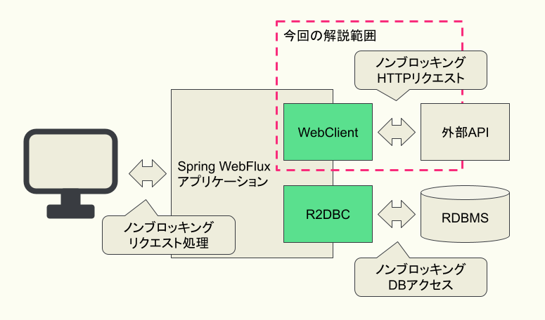

:toc: left
:toctitle: 目次
:sectnums:
:sectanchors:
:sectinks:
:chapter-label:

= 03 リアクティブなHTTPクライアント WebClient入門

ノンブロッキングなWebアプリケーションを作るためには、
リクエストを処理する一連の流れを全てノンブロッキングに実装することが重要です。
もし1カ所でもブロッキングな処理があるとイベントループスレッドをブロックしてしまい、処理性能が著しく低下します。
これを回避するには、外部APIへのリクエストやRDBMSへのアクセスなどもノンブロッキングに実装するための仕組みが必要です。
そこで今回は、Spring WebFluxに内包されたリアクティブ／ノンブロッキングなHTTPクライアントである「WebClient」について解説します。

== WebClientの基本

WebClientはノンブロッキングなHTTPリクエストを実現するための機能です。
Spring WebFluxと同様にReactorベースのFluent APIを備えており、メソッドチェインによってHTTPリクエストを実現できます。

なお、WebClientはSpring WebFluxに内包された機能ではありますが、Spring MVCと組み合わせて使用することも可能です。
Spring MVCでは「RestTemplate」というHTTPクライアントを提供していますが、
RestTemplateはSpring Framework 5.0でメンテナンスモードとなり、今後はWebClientを使用することを推奨しています。

Spring Bootを利用する場合、WebClientを生成するためのBuilderがあらかじめBean定義されています。
そのため、以下のように実装することでWebClientのインスタンスを取得可能です。
このWebClientインスタンスを使って、各種リクエスト処理を実行します。

[source, java]
----
@Component
public class WebClientSample {
    private final WebClient webClient;

    public WebClientSample(WebClient.Builder webClientBuilder) {
        this.webClient = webClientBuilder.build();
    }
}
----

=== WebClientによるGETリクエストの実装

WebClientのgetメソッドを使うことで、GETリクエストを実装します。
getメソッドに続けてuriメソッドやacceptメソッドを使用し、
リクエスト先のURLやAcceptヘッダなどのリクエストに必要な情報を設定します。
その後、retriveメソッドを挟んでbodyToMonoメソッドなどを使用し、レスポンスの処理方法を設定します。
bodyToMonoメソッドでは、レスポンスボディの情報から引数で指定したクラスのMonoを生成します。
同様に、bodyToFluxメソッドを使うことで指定したクラスのFluxを生成することも可能です。
以下の例では、「http://localhost:8081/messages/1」というURLに対して、
Acceptヘッダに「application/json」を設定したGETリクエストを送信し、
レスポンスボディからMessageクラスのMonoを生成しています。

[source, java]
----
Mono<Message> message = webClient.get()
    .uri("http://localhost:8081/messages/1")
    .accept(MediaType.APPLICATION_JSON)
    .retrive()
    .bodyToMono(Message.class);
----

=== WebClientによるPOSTリクエストの実装

WebClientのpostメソッドを使うことで、POSTリクエスト実装します。
レスポンスの処理方法の設定はGETリクエストの時と同様にretriveメソッドとbodyToMonoメソッドやbodyToFluxメソッドを使用します。
リクエストに必要な情報の設定では、リクエスト先のURLの設定などに加えて、リクエストボディに関する設定を行います。
リクエストボディのContent-Typeはデフォルトで「application/x-www-form-urlencoded」となっており、フォーム形式でのリクエストを送信します。
フォーム形式のリクエストボディを設定する方法としては、「MultiValueMap<String, String>」を使用する方法と、BodyInsertersを使用する方法があります。

以下の例では、「MultiValueMap<String, String>」を使用してフォーム形式のリクエストボディの値を作成し、
bodyValueメソッドを使用してリクエストボディに設定しています。

[source, java]
----
MultiValueMap<String, String> formData = new LinkedMultiValueMap<>();
formData.add("message", "echo using MuliValueMap");

Mono<Message> message = webClient.post()
        .uri("http://localhost:8081/messages")
        .bodyValue(formData)
        .retrieve()
        .bodyToMono(Message.class);
----

以下の例は、先ほどの例と同じ処理をBodyInsertersを使用して実現した例です。
BodyInsertersのstaticメソッドであるfromFormDataメソッドを使用して値を作成します。
作成した値は、先ほどのbodyValueメソッドではなく、bodyメソッドを使用してリクエストボディに設定します。

[source, java]
----
Mono<Message> message = webClient.post()
        .uri("http://localhost:8081/messages")
        .body(fromFormData("message", "echo using BodyInserters"))
        .retrieve()
        .bodyToMono(Message.class);
----

ファイルアップロード時のようなマルチパートデータを送信する場合にも同じように実装することができます。
マルチパートデータの場合には、MultiValueMap<String, HttpEntity<?>>型になります。
MultipartBodyBuilderを使うことでマルチパートデータを簡単に生成できます。
また、BodyInsertersのfromMultipartDataメソッドを使用することも可能です。

[source, java]
----
// MulipartBodyBuilderの使用例
Resource resource = new ClassPathResource("file.txt");
MultipartBodyBuilder builder = new MultipartBodyBuilder();
builder.part("file", resource);
builder.part("description", "uploaded file");
MultiValueMap<String, HttpEntity<?>> parts = builder.build();

Mono<Message> message = webClient.post()
        .uri("http://localhost:8081/upload")
        .bodyValue(parts)
        .retrieve()
        .bodyToMono(Message.class);

// fromMulipartDataの使用例
Mono<Message> message = webClient.post()
        .uri("http://localhost:8081/upload")
        .body(fromMulipartData("file", resource).with("description", "uploaded file"))
        .retrieve()
        .bodyToMono(Message.class);
----

リクエストボディのContent-Typeを設定することで、Javaのオブジェクトを使用してJSON形式のリクエストボディを設定することもできます。

[source, java]
----
Mono<Message> message = webClient.post()
    .uri("http://localhost:8081/messages")
    .contentType(MediaType.APPLICATION_JSON)
    .bodyValue(new Message("POST Message"))
    .retrive()
    .bodyToMono(Message.class);
----

== WebClientの実践的な使い方

ここからは、WebClientのより実践的な使い方について紹介していきます。

=== WebClientのカスタマイズ方法

WebClientの挙動をカスタマイズする方法は大きく分けて2つあります。
1つ目の方法はWebClientのBuilderを通じてカスタマイズする方法です。
BuilderにはベースURL、デフォルトのヘッダ、Cookieなどを設定するためのメソッドが用意されており、
これらのメソッドを通じてカスタマイズすることができます。

[source, java]
----
WebClient webClient = builder
        .baseUrl("http://localhost:8081")
        .defaultHeader(HttpHeaders.CONTENT_TYPE, MediaType.APPLICATION_JSON_VALUE)
        .defaultCookie("key", "value")
        .build();
----

なお、Spring Bootを利用している場合、「WebClientCustomizer」というインタフェースが提供されており、
このインタフェースを実装したクラスを作成してBean定義することで、
Spring BootによってBean定義されているBuilderをカスタマイズすることが可能です。

[source, java]
----
@Component
public class CommonWebClientCustomizer implements WebClientCustomizer {
    @Override
    public void customize(WebClient.Builder webClientBuilder) {
        webClientBuilder
                .baseUrl("http://localhost:8081")
                .defaultHeader(HttpHeaders.CONTENT_TYPE, MediaType.APPLICATION_JSON_VALUE)
                .defaultCookie("key", "value");
    }
}
----

2つ目の方法は、WebClientの内部で使用されるHttpClientを通じてカスタマイズする方法です。
WebClientの内部のHttpClientのAPIを使用することでより細かいカスタマイズをすることができます。
後述するタイムアウトは、こちらの方法のみで設定することが可能です。

[source, java]
----
HttpClient httpClient = HttpClient.create()
    .responseTimeout(Duration.ofSeconds(5));
WebClient client = builder
    .clientConnector(new ReactorClientHttpConnector(httpClient))
    .build();
----

Spring Bootを使用している場合、WebClientCustomizerと同じようなかたちでカスタマイズを適用するためのインタフェースとして、
「ReactorNettyHttpClientMapper」が提供されています。

[source, java]
----
@Component
public class ReactorNettyHttpClientTimeoutMapper implements ReactorNettyHttpClientMapper {
    @Override
    public HttpClient configure(HttpClient httpClient) {
        return httpClient.responseTimeout(Duration.ofSeconds(5));
    }
}
----

=== タイムアウトの設定

HTTPクライアントを利用する際には、接続先の障害や遅延を想定し、コネクションタイムアウトやレスポンスタイムアウトを設定することが重要です。
WebClientの場合、HttpClientのAPIを通じて各種タイムアウトを設定します。
以下は、コネクションタイムアウトに10000ミリ秒（10秒）、レスポンスタイムアウトに5秒を設定している例です。

[source, java]
----
HttpClient httpClient = HttpClient.create()
    .option(ChannelOption.CONNECT_TIMEOUT_MILLIS, 10000)
    .responseTimeout(Duration.ofSeconds(5));
----

=== filterによる共通処理の適用

WebClientでは、「filter」という機能を使うことにより、リクエストに対して共通の処理を適用できます。

例えば、共通のヘッダを付与するfilterは以下のように実装します。
この場合、Builderのfilterメソッド内で定義されているラムダ関数がfilterの実体になります。

[source, java]
----
WebClient webClient = builder
    .filter((request, next) => {
        ClientRequest filtered = ClientRequest.from(request)
            .header("foo", "bar")
            build();
        return next.exchange(filtered);
    })
    .build();
----

=== エラーハンドリング

WebClientではレスポンスのステータスコードが400番台や500番台の場合、各ステータスコードに対応した例外を発生させます。
これらの例外は全てWebClientResponseExceptionを継承したクラスになっており、
エラー処理をまとめて実装することもステータスコードごとに実装することもできます。
エラー処理の実装には、Reactorの仕組みを使います。
Reactorでは、例外をキャッチして処理を継続するためのonErrorResumeや、
発生した例外を別の例外に変換するonErrorMapなどを使用してエラー処理を実装します。
以下の例では、レスポンスのステータスコードが500の場合に独自のエラーメッセージを含むMessageを返すように実装しています。

[source, java]
----
Mono<Message> message = webClient.post()
        .uri("http://localhost:8081/messages")
        .body(fromFormData("message", "echo using BodyInserters"))
        .retrieve()
        .bodyToMono(Message.class)
        .onErrorResume(WebClientResponseException.InternalServerError.class, 
            e -> Mono.just(new Message("Internal Server Error")));

----

=== リトライ

HTTPリクエストがエラーになった場合のリトライもReactorの仕組みを使うことで簡単に実装することができます。
基本的なリトライの実装は以下のようになります。
Retryのstaticメソッドでリトライ方法を指定し、それをretryWhenに渡します。
ここでは、Retry.maxにより5回リトライするという内容を指定しています。

[source, java]
----
Mono<Message> message = webClient.get()
    .uri("http://localhost:8081/messages/1")
    .accept(MediaType.APPLICATION_JSON)
    .retrive()
    .bodyToMono(Message.class)
    .retryWhen(Retry.max(5));
----

Retry.max以外にも、以下のようなstaticメソッドが用意されています。

|===
|メソッド | リトライ回数 | リトライ間隔

|Retry.indefinitely | 無限 | すぐ 
|Retry.max          | 指定した回数 | すぐ
|Retry.maxInARow    | 連続で指定した回数エラーになるまで | すぐ
|Retry.fixedDelay   | 指定した間隔で、指定した回数 | 引数で指定した間隔
|Rtery.backoff      | 徐々にリトライ間隔を長くしながら、指定した回数 | 引数で指定した時間 * 2のn-1乗 + ゆらぎ（n：リトライ回数）
|===

== まとめ

今回は、リアクティブなHTTPクライアント、WebClientについて基本的な使い方から実践的な使い方まで解説しました。

次回はリアクティブなDBアクセスのための技術であるR2DBCについて解説します。