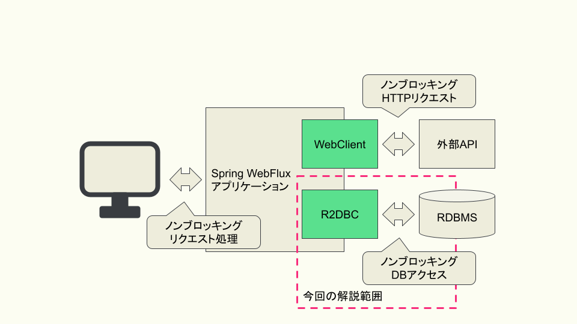

:toc: left
:toctitle: 目次
:sectnums:
:sectanchors:
:sectinks:
:chapter-label:

= 04 リアクティブなDBアクセス　R2DBC入門

前回はAPIアクセスをノンブロッキングに実装する仕組みについて解説しましたが、
Webアプリケーションを実装する上ではDBアクセスも欠かすことができません。
今回はノンブロッキングなDBアクセスを実現するための仕組みであるR2DBCについて解説します。

== R2DBCとは

R2DBCは「Reactive Relational Database Connectivity」の略称で、
リアクティブなDBアクセスを実装するためのAPIを提供するライブラリです。
R2DBCは、JDBCと同様、共通的なインタフェースの定義と、各DBに対応するドライバの実装に分かれています。
R2DBCでは「Service Provider Interface（SPI）」が定義され、
各DBのドライバはそのSPIを実装する形で提供されています。
また、R2DBCは連載第2回で紹介したReactive StreamsベースのAPIを定義しており、
Spring WebFlux内で使われているReactorのほか、
RxJavaなどのReactive Streams準拠のライブラリと組み合わせて使うこともできるようになっています。

== R2DBCとSpring Framework

Spring FrameworkにおいてR2DBCを使うためのライブラリはSpring R2DBCとSpring Data R2DBCの2つがあります。
もともとはSpring Data R2DBCを中心に開発が進められていましたが、
Spring Framework 5.3から新たにSpring R2DBCが導入され、共通的な機能はSpring R2DBCに移管されました。
そのため、Spring Framework 5.3以降（Spring Data R2DBC 1.2以降）とそれ以前では使い方が異なる点に注意が必要です。
本記事では、Spring Framework 5.3（Spring Data R2DBC 1.2以降）以降を前提に解説します。
それ以前のバージョンを使用している方は、Spring Data R2DBCが提供している link:https://docs.spring.io/spring-data/r2dbc/docs/current/reference/html/#migration-guide[マイグレーションガイド] も合わせて参照してください。

Spring Bootと組み合わせて使う場合には、「spring-boot-starter-data-r2dbc」が提供されており、
以下のように各DBのドライバと合わせて依存関係に含めることでSpring R2DBCもSpring Data R2DBCも使用することができます。

[source, xml]
----
<dependency>
    <groupId>org.springframework.boot</groupId>
    <artifactId>spring-boot-starter-data-r2dbc</artifactId>
</dependency>
<!-- MySQLに対応したR2DBCドライバの実装 -->
<dependency>
    <groupId>dev.miku</groupId>
    <artifactId>r2dbc-mysql</artifactId>
    <scope>runtime</scope>
</dependency>
----

=== Spring R2DBC

Spring R2DBCはSpring FrameworkにおいてR2DBCを使うためのコアとなるライブラリです。
Spring R2DBCでは、基本的なDBアクセスクライアントであるDatabaseClientのほか、
コネクションを生成するための仕組みやトランザクション管理の仕組みなどを提供しています。

=== Spring Data R2DBC

Spring Data R2DBCはSpring Frameworkが提供するデータアクセスライブラリであるSpring Dataの一つで、
Spring Data JPAやSpring Data JDBCなどと同じような形でR2DBCを扱うことができるライブラリです。
Spring Data R2DBCでは、エンティティベースのDBアクセスクライアントであるR2dbcEntityTemplateや、
他のSpring Dataと同様にインタフェースを定義するだけで基本的なCRUDを実装できるReactiveCrudRepositoryなどを提供しています。

== R2DBCを使ったCRUDの実装

ここからはSpring R2DBC、Spring Data R2DBCの機能を用いたCRUDの実装方法について解説していきます。
Spring R2DBCのDatabaseClient、Spring Data R2DBCのR2dbcEntityTemplate、ReactiveCrudRepositoryの3つの機能について、
それぞれCRUDの実装方法を見ていきます。
その後、DBアクセスを実装する上で重要なトランザクション制御の実装方法およびコネクションプールの利用方法についても解説します。
例として、以下のDDLで定義されるテーブルを使用します。

[source, sql]
----
CREATE TABLE department
(
    id   INT NOT NULL PRIMARY KEY,
    name VARCHAR(256)
);
----

また、departmentテーブルに対応するエンティティクラスとして、以下のように実装されるDepartmentクラスを使用します。

[source, java]
----
public class Department {
    private int id;
    private String name;

    public Department(int id, String name) {
        this.id = id;
        this.name = name;
    }

    public int getId() {
        return id;
    }

    public String getName() {
        return name;
    }
}
----

=== DatabaseClient

DatabaseClientは3つの実装方法のうち、もっとも抽象度の低い実装方法を提供しています。
Spring Bootとともに「spring-boot-starter-data-r2dbc」を使用している場合、
DatabaseClientはあらかじめBean定義されているため、以下のように実装することでインスタンスを取得できます。

[source, java]
----
@Repository
public class DepartmentDatabaseClientRepository {

    private DatabaseClient client;

    public DepartmentDatabaseClientRepository(DatabaseClient client) {
        this.client = client;
    }
}
----

DatabaseClientを使用してSELECT文を実行する場合、以下のように実装します。

[source, java]
----
public Flux<Department> findByName(String departmentName) {
    return client.sql("SELECT id, name FROM department WHERE name = :name")  // <1>
            .bind("name", departmentName)                                    // <2>
            .map(row -> {                                                    // <3>
                int id = row.get("id", Integer.class);
                String name = row.get("name", String.class);
                return new Department(id, name);
            }).all();                                                        // <4>
}
----
<1> sqlメソッドを使い、実行するSQL文を指定します。この時コロンから始まるパラメータを書いておくと、あとで値を挿入できます。
<2> bindメソッドを使い、前述のSQL文内で指定したパラメータに対して値を挿入します。
<3> mapメソッドの中でSQLの実行結果（Rowクラスのインスタンス）を変換するためのラムダ関数を定義します。
<4> allメソッドを使い、実行結果を全て取得することを指定します。そのほか、最初の1件のみを取得するfirstメソッドや、結果が0または1件の場合に使用するoneメソッドがあります。

INSERT文、UPDATE文、DELETE文を実行する場合、それぞれ以下のように実装します。
sqlメソッドとbindメソッドはさきほどと同じように使用します。
その上で、mapメソッドではなく、fetchメソッドとrowsUpdatedメソッドを使用して追加、変更、削除された行数を返します。

[source, java]
----
public Mono<Integer> insert(Department department) {
    return client.sql("INSERT INTO department (id, name) VALUES (:id, :name)")
            .bind("id", department.getId())
            .bind("name", department.getName())
            .fetch()
            .rowsUpdated();
}
----

[source, java]
----
public Mono<Integer> updateById(Department department) {
    return client.sql("UPDATE department SET name = :name WHERE id = :id")
            .bind("id", department.getId())
            .bind("name", department.getName())
            .fetch()
            .rowsUpdated();
}
----

[source, java]
----
public Mono<Integer> deleteById(Department department) {
    return client.sql("DELETE FROM department WHERE id = :id")
            .bind("id", department.getId())
            .fetch()
            .rowsUpdated();
}
----

=== R2dbcEntityTemplate

R2dbcEntityTemplateはFluentなAPIを備え、メソッドチェインによってSQLと同等の処理を実装できる機能です。
Spring Bootと「spring-boot-starter-data-r2dbc」を使用している場合、
R2dbcEntityTemplateもあらかじめBean定義されており、以下のように実装することでインスタンスを取得できます。

[source, java]
----
@Repository
public class DepartmentEntityTemplateRepository {
    private R2dbcEntityTemplate template;

    public DepartmentEntityTemplateRepository(R2dbcEntityTemplate template) {
        this.template = template;
    }
}
----

R2dbcEntityTemplateでは、SQL文に対応したメソッドが用意されており、
そのメソッドを起点に処理を実装します。
SELECT文の場合、selectメソッドが起点に以下のように実装します。

なお、R2dbcEntityTemplateは現状1つのテーブルを対象とする操作のみが実装されており、
JOINや副問い合わせといった複雑なSQLと同等の処理は実現できません。

[source, java]
----
public Flux<Department> findByName(String name) {
    return template.select(Department.class)                               // <1>
            .from("department")                                            // <2>
            .matching(query(where("name").is(name)).sort(by(desc("id"))))  // <3>
            .all();                                                        // <4>
}
----
<1> selectメソッドの引数にはエンティティのクラスを指定します。
<2> fromメソッドを使い、テーブル名を指定します。指定しない場合にはエンティティクラス名からテーブル名が類推されます。
<3> matchingメソッドおよび各種staticメソッドを使用して検索条件を指定します。ここでは、「WHERE name = :name ORDER BY id DESC」相当の条件を指定しています。
<4> allメソッドを使用して実行結果を全て取得することを指定します。このほか、件数のみを取得するcountメソッドや結果が1件以上あるかどうかを返すexistsメソッドなどがあります。

INSERT文では、insertメソッドが起点になります。
テーブル名を指定する場合には、SQLの記法に合わせてintoメソッドを使用します。
追加するレコードの内容はusingメソッドを使用してエンティティのオブジェクトを渡します。

[source, java]
----
public Mono<Department> insert(Department department) {
    return template.insert(Department.class)
            .into("department")
            .using(department);
}
----

UPDATE文では、updateメソッドを起点に以下のように実装します。

[source, java]
----
public Mono<Integer> updateById(Department department) {
    return template.update(Department.class)
            .inTable("department")                                // <1>
            .matching(query(where("id").is(department.getId())))  // <2>
            .apply(update("name", department.getName()));         // <3>
}
----
<1> テーブル名の指定にはinTableメソッドを使用します。
<2> SQLのWHERE句にあたる部分は、SELECTの時と同様にmatchingメソッドを使用します。
<3> 更新内容はapplyメソッド、updateメソッドを用いて指定します。updateメソッドの引数には更新対象のカラム名と更新に用いる値を指定します。複数カラムをまとめて更新したい場合には、updateメソッドに続けてsetメソッドを使用することで、別のカラムに対する更新内容を定義できます。

DELETE文では、deleteメソッドを起点に以下のように実装します。

[source, java]
----
public Mono<Integer> deleteById(Department department) {
    return template.delete(Department.class)
            .from("department")                                   // <1>
            .matching(query(where("id").is(department.getId())))  // <2>
            .all();                                               // <3>
}
----
<1> テーブル名の指定にはfromメソッドを使用します。
<2> SQLのWHERE句にあたる部分は、SELECT、UPDATEと同様にmatchingメソッドを使用します。
<3> allメソッドを使用して条件に合致するレコードを全て削除することを指定します。

=== ReactiveCrudRepository

ReactiveCrudRepositoryは、このインタフェースを継承したインタフェースを定義するだけで基本的なCRUDの実装を自動的に生成する機能です。
以下のように、ReactiveCrudRepositoryインタフェースを継承したインタフェースを定義します。
その際、ReactiveCrudRepositoryのジェネリクスにはエンティティクラスと主キーとなるカラムの型を指定します。
これだけで基本的なCRUDを実現することができます。

[source, java]
----
@Repository
public interface DepartmentCrudRepository extends ReactiveCrudRepository<Department, Integer> {
}
----

この機能を利用する場合、以下のように定義したインタフェースの型でインジェクションを行い、インスタンスを取得します。
これにより、主キーを使ったSELECT文を発行するfindByIdメソッドや、INSERT文もしくはUPDATE文を発行するsaveメソッドなどを使用できます。

[source, java]
----
@Service
public class DepartmentCrudService {

    DepartmentCrudRepository departmentCrudRepository;

    public DepartmentCrudService(DepartmentCrudRepository departmentCrudRepository) {
        this.departmentCrudRepository = departmentCrudRepository;
    }

    public Mono<Department> findById(int id) {
        return departmentCrudRepository.findById(id);
    }

    public Mono<Department> save(Department department) {
        return departmentCrudRepository.save(department);
    }
}
----

ReactiveCrudRepositoryが標準で用意しているメソッド以外の機能を実装したい場合、
以下のようにインタフェースの中でメソッドを定義することによって実現できます。
この時発行されるSQL文はメソッド名から一定のルールに従って生成されます。
以下の例では、検索条件が「WHERE name = :name」となるSQL文が実行されます。
詳しいルールについては link:https://docs.spring.io/spring-data/r2dbc/docs/current/reference/html/#r2dbc.repositories.queries[公式ドキュメント] を参照してください。

[source, java]
----
@Repository
public interface DepartmentCrudRepository extends ReactiveCrudRepository<Department, Integer> {
    Flux<Department> findByName(String name);
}
----

=== トランザクション制御の実装

Spring R2DBC、Spring Data R2DBCを利用する場合、従来のJDBCの時と同様、非常に簡単にトランザクション制御を実装できます。
Spring R2DBCがSpring Frameworkの仕組みに準拠したトランザクションマネージャの実装を提供しているため、
@Transactionalアノテーションをメソッドに付与するだけでトランザクション制御を実装できます。

[source, java]
----
@Service
public class DepartmentCrudService {

    @Transactional
    public Mono<Department> save(Department department) {
        return departmentCrudRepository.save(department);
    }
}
----

=== コネクションプールの利用

R2DBCではr2dbc-poolというコネクションプールの実装が提供されています。
Spring BootとSpring R2DBC、Spring Data R2DBCを組み合わせて利用している場合、
R2DBC接続文字列として以下のように「r2dbc:pool:」から始まる文字列を設定すると、
Spring Bootが自動的にコネクションプールを有効化します。

[source, yaml]
----
spring:
  r2dbc:
    url: r2dbc:pool:mysql://localhost:3306/sandbox
----

== まとめ

今回はノンブロッキングなDBアクセスを実現する技術であるR2DBCと、
それをSpring Frameworkの中で利用するためのライブラリについて解説しました。

これまで4回にわたり、リアクティブなWebアプリケーションを実装するためのフレームワークであるSpring WebFluxを中心として、
リアクティブプログラミング、リアクティブなHTTPクライアント、リアクティブなDBアクセス技術の基本について解説してきました。
本連載の内容を参考に、ぜひリアクティブな技術を活用していってください。
